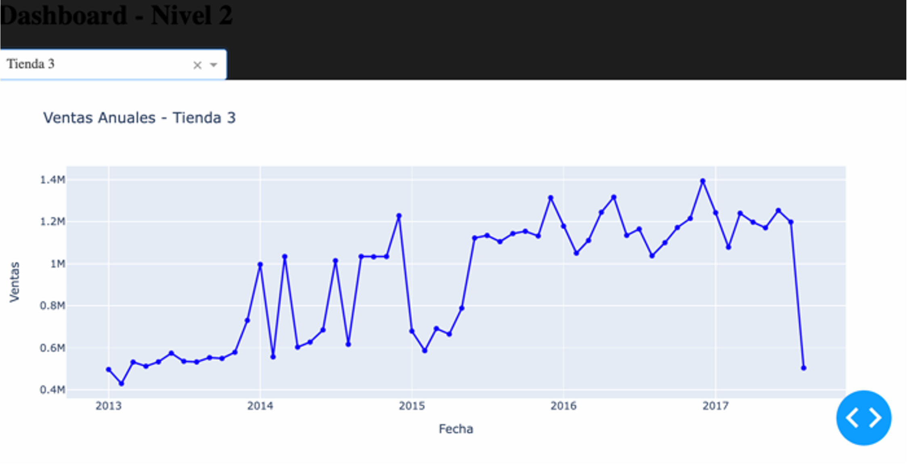

# Proyecto Final – Visualización de Datos



**Autor:** Javier Mendoza Guerrero  
**Grado:** Ingeniería Matemática e Inteligencia Artificial (iMAT)  

---

## Descripción

Proyecto Final de la asignatura **Visualización de Datos**.  
Se desarrolla un **dashboard interactivo** con **Plotly Dash** para una **empresa global de alimentación**, cuyo objetivo es visualizar **KPIs clave de ventas** y ofrecer insights claros mediante gráficos dinámicos.  

El sistema permite analizar las **ventas mensuales** y el rendimiento general de la compañía. Incluye:  
- Gráficos de barras, líneas y burbujas.  
- Tablas interactivas.  
- Heatmaps con patrones de venta.  
- Filtros, selectores y comparaciones temporales.  

La carga de datos se realiza a partir de **archivos CSV combinados**, y el dashboard cumple **niveles progresivos de implementación**: desde visualizaciones básicas hasta análisis avanzados.

---

## Desarrollo

- 641 líneas de código  
- 1 módulo  
- 5 funciones  
- 2 ficheros CSV de datos  
- Librerías utilizadas:  
  - `pandas 2.2.3`  
  - `dash 2.18.2`  
  - `plotly 5.9.0`

---

## Resultados

El dashboard consta de 4 pestañas principales:

### N1: Resumen de Métricas Básicas
- Contador con número total de tiendas, productos y estados.  
- Gráfico de barras interactivo con los 10 productos más vendidos.  
- Gráfico de líneas con las ventas mensuales.  

---

### N2: Ventas por Tienda
- Dropdown para seleccionar una tienda.  
- Gráfico interactivo con ventas anuales de la tienda seleccionada.  
- Tabla resumen de productos en promoción.  

---

### N3: Análisis Avanzado
- Gráfico interactivo para analizar estacionalidad (ventas diarias, promociones, días festivos).  
- Gráfico de burbujas que compara ventas promedio, productos en promoción y transacciones.  
- Heatmap interactivo para explorar patrones de venta por día y hora.  

---

### N4: Documentación
- Guía explicativa de la lógica del dashboard.  
- Explicación de cómo cada visualización se alinea con los objetivos de análisis.  

---

## Ejecución

1. Instalar dependencias:  
   ```bash
   pip install pandas==2.2.3 dash==2.18.2 plotly==5.9.0

2. Ejecutar el dashboard:
   python app.py

3. Abrir en el navegador: http://127.0.0.1:8050/

## Archivos

app.py → Código principal del dashboard.
data_ventas.csv → Datos de ventas globales.
data_promociones.csv → Datos de promociones.
Carpeta imagenes/ → Capturas para README.
